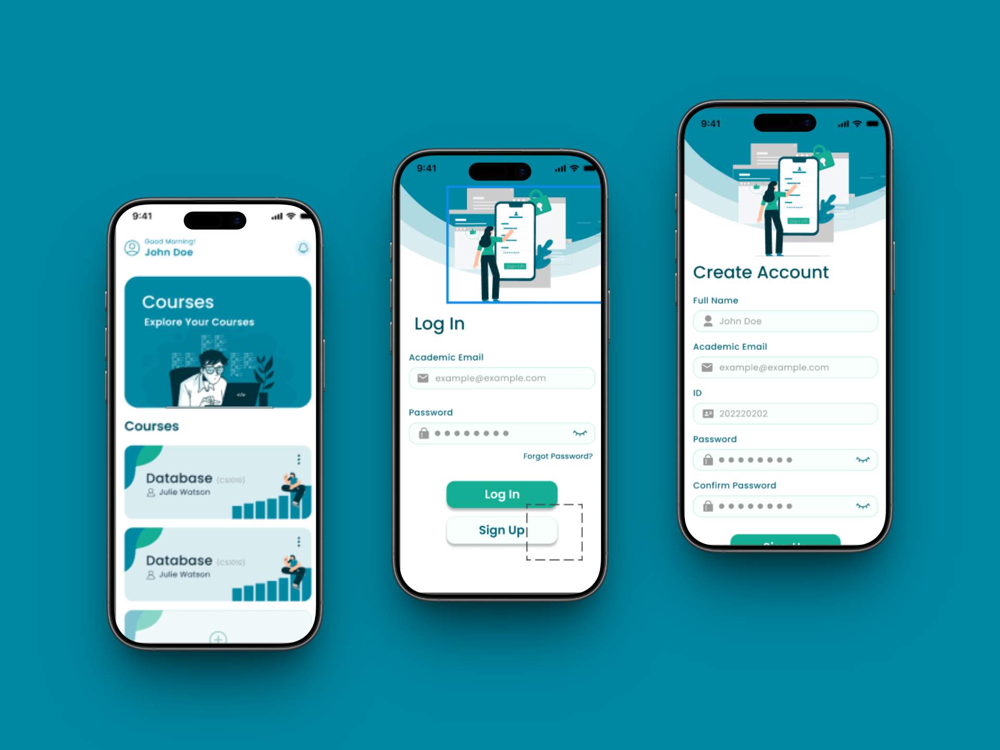
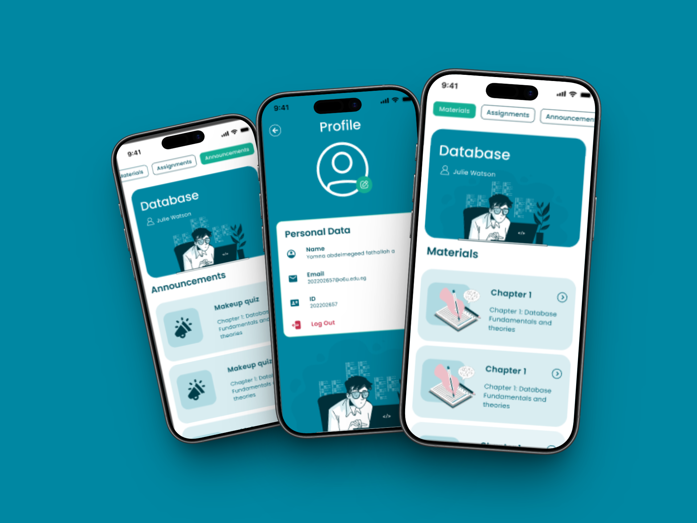

# academiaX

### Graduation Project — Flutter (Web & Mobile)

`Flutter` `Web & Mobile` `Graduation Project`

---

## Overview

academiaX is a cross-platform academic management platform that centralizes learning, assessment, live instruction, grading, and academic integrity into a single, unified system. Built using Flutter, the platform supports both **Web and Mobile** environments with role-based access for students and instructors.

 

&nbsp;

---

## Roles & Access

| Role | Capabilities |
|---|---|
| **Instructor** | Create courses, create quizzes, upload Excel grade sheets, configure the grading structure, enable/review AI plagiarism detection, manage profile |
| **Student** | Take quizzes, submit assignments, view announcements & comment on them, view grades, manage profile |

---

## Core Features

- **Authentication** — secure login for both instructors and students
- **Course Creation** — instructors create and manage their own courses
- **Quizzes** — instructors create quizzes; students take them online
- **Assignments** — students upload assignment submissions per course
- **Announcements** — instructors post announcements; students can comment on them
- **Profiles** — dedicated profile views for both instructors and students
- **Dynamic Grading Table** — auto-generated based on the instructor's grading configuration (quizzes, assignments, midterm, etc.)
- **Excel Grade Import** — instructors upload an Excel sheet of grades, parsed and mapped directly into the dynamic grading table

---

## AI-Powered Plagiarism Detection

One of academiaX's key differentiators is its built-in academic integrity layer:

- When creating a course, the instructor decides whether **AI plagiarism detection** is enabled for that course
- If enabled, every assignment submission is automatically cross-checked against other students' submissions
- The system calculates a **similarity percentage** between submissions
- Grades are **not** pushed to the grading table automatically — the instructor must first **review the similarity report and approve** the submission
- If the feature is **disabled** for a course, assignments are graded and reflected normally without any AI check

This ensures instructors stay fully in control of how academic integrity is enforced, course by course.

---

## How Grading Works

1. Instructor creates a course and defines the **grading configuration** (e.g. weight/structure for quizzes, assignments, midterm)
2. Quizzes and assignments are completed by students throughout the course
3. For courses with AI detection **enabled**, the instructor reviews flagged assignments and approves them before grades are finalized
4. Instructor uploads the **Excel sheet** with grades (or grades are calculated from quizzes/assignments directly)
5. All scores are automatically organized into a **dynamic table** per student, structured according to the course's configuration

---

## Tech Stack

- Flutter
- Dart
- Web
- Mobile
- AI Plagiarism Detection
- Excel Import

---

## Repository

GitHub: [nadia022/sams-app](https://github.com/nadia022/sams-app)
